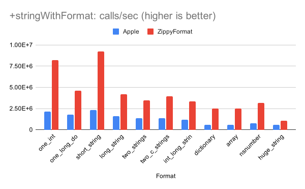

# ZippyFormat
## A faster version of +stringWithFormat:

[](https://cocoapods.com)

## Benchmarks



These benchmarks were done on an iPhone XS. The results on Mac are very similar. Note there are a few cases (positional arguments, `%S`, `%C`, malformed input) where ZippyFormat falls back to calling Apple's version. These cases, however, seem very uncommon for typical usage (e.g. localized strings with positional arguments would typically use`NSLocalizedString` instead). For more info, see [here](misc/benchmarks.txt).

## Usage

Just add `#import <ZippyFormat/ZippyFormat.h>` at the top of the file and replace `[NSString stringWithFormat:...]` with `[ZIPStringFormat stringWithFormat:...]` wherever you want to use it.

## Why is it so much faster?

- NSString grows an NSMutableString (or at least, its CoreFoundation relative) to create the string, whereas ZippyFormat appends directly into a `char *` buffer and only creates an NSString from it at the very end
    - ZippyFormat is able to use the stack for the `char *` up to a point, avoiding intermediate heap allocations that NSMutableString would make, since NSMutableString is always prepared to be used outside of its initial scope
    - Appends formatted arguments into the `char *` without performing validation because it already knows the data is valid UTF-8. NSMutableString's methods, on the other hand, are generic for other use cases and make fewer assumptions about the incoming bytes. This means additional unnecessary validation.
- For `%@` arguments, NSString just appends `[object description]`. However, objects passed to debugging statements often consist of one of just a few classes (NSNumber, NSDictionary, NSArray, etc.). For these cases, ZippyFormat "inlines" the appending of the description by just copying the output it knows that it would consist of to the buffer, and doesn't call `[object description]` at all.

So, it's largely due to Apple trying to be elegant and operate at a higher level.

## Installation

### Cocoapods

ZippyFormat is available through [CocoaPods](https://cocoapods.org). To install
it, simply add the following line to your Podfile:

```ruby
pod 'ZippyFormat'
```

### Manually

ZippyFormat is just a few files, with no nested import structure or anything, so just copying the files in is pretty easy.

## Author

Michael Eisel, michael.eisel@gmail.com
